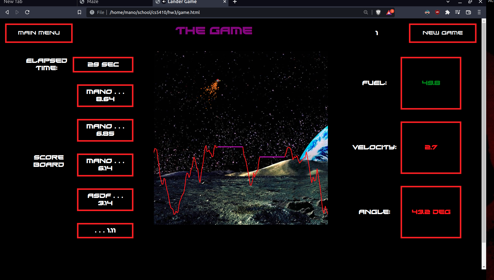
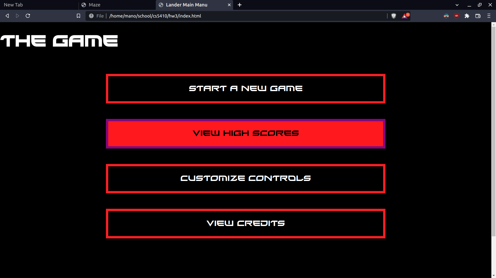

# Lunar Lander Vanilla JS

## About this repo ###
This is a project I built when taking a game development class. THe code demonstrates the basic functionalities of a game engine, particle generators, user input handling, algorithmic terrain generation, etc. This project uses no frameworks or helps. This is supposed to facilitate learning the basic mechanisms that make a game engine work at its core.



### How do I get set up? ###
* clone the repo
  * ```git clone https://github.com/Manodiestra/lunar-landar-vanila-js.git```
* Open index.html in your favorite privacy focused web browser.

### How do I play? ###
index.html will land you on a main menu where you can customize controls, see the leaderboard (local games only), and start a new game. By default, use the arrow keys to fly the lunar lander. You must land on the purple landing pads in a mostly vertical orientation and at a safe speed, which are both displayed on the HUD. There are 3 levels. If you die or win you have to click the New Game button to play again.



### Contribution guidelines ###
This repository is not being worked on. You're welcome to submit bugs or pull requests and I would be happy to respond to them.
